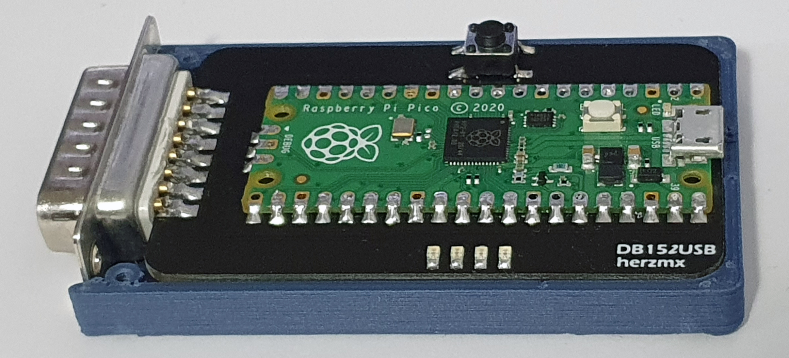

# USB2DB15 Board

This board is intended to use NeoGeo Stick/Pad with DB15 port as USB controller on PC, MiSTer, Android, Raspberry Pi, Nintendo Switch, PS3 and PS4 (legacy), thanks to GP2040[GP2040](https://github.com/FeralAI/GP2040) gamepad firmware for the Raspberry Pi Pico.

